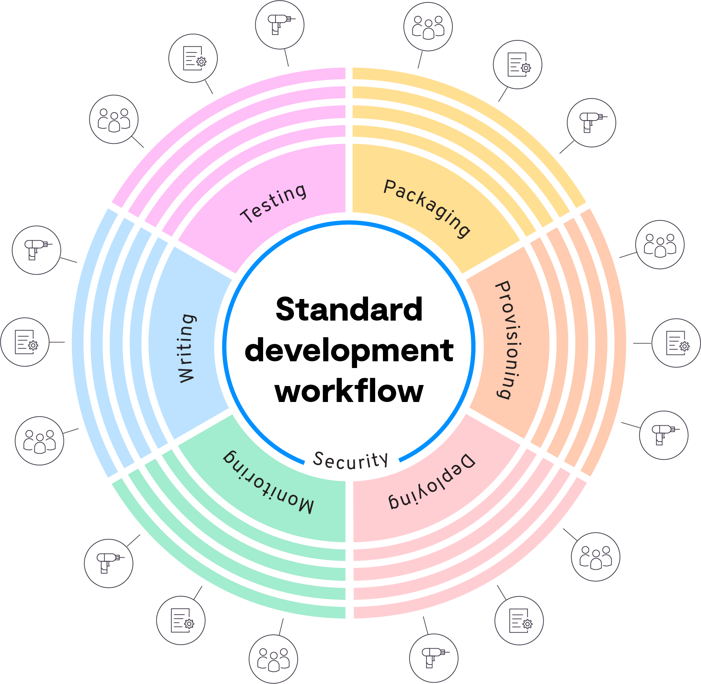

<!-- HEADER -->

<h1 align="center">We're Platform.sh! </h1>

 

<!-- TABLE OF CONTENTS -->

<strong>Contents</strong>
  
<a href="#what-is-platformsh"><strong>What is Platform.sh?</strong></a>&nbsp&nbsp&nbsp&nbsp&nbsp&nbsp
<a href="#how-does-it-work"><strong>How does it work?</strong></a>&nbsp&nbsp&nbsp&nbsp&nbsp&nbsp
<a href="#getting-started"><strong>Getting started</strong></a>&nbsp&nbsp&nbsp&nbsp&nbsp&nbsp
<a href="#resources"><strong>Resources</strong></a>&nbsp&nbsp&nbsp&nbsp&nbsp&nbsp
 

<!-- WHAT IS PLATFORM.SH -->
<h2 align="center"><strong>What is Platform.sh?</strong></h2>

[Platform.sh](https://platform.sh/product/) is a unified, secure, enterprise-grade platform for building, running and scaling web applications. We provide a solution that addresses the complexity of application delivery, providing both the stability and flexibility you would like to achieve with platform engineering. 

 

<em>Click the thumbnail above for an overview of Platform.sh.</em>

From our platform, you can standardize your delivery across any architecture design, framework, or programming language, and easily enforce common compliance standards across them all. It's flexible enough to experiment with new features quickly on true staging environments, and promote them to production with a git merge. 

With a common platform and single API in place for packaging, provisioning, and deploying applications, it's then possible to focus DevOps work on optimizing those apps. Whether that be application performance, or coordinating all of your operations, all for the purpose of minimizing the environmental impact of your organization's work.

<!-- HOW DOES IT WORK -->
<h2 align="center"><strong>How does it work?</strong></h2>

<em>Click above to see how Platform.sh addresses the complexity of application delivery.</em>

<strong>The problem:</strong> what makes application delivery complex?
 

Today delivery means coordinating specialized teams of people, unique configuration, and dedicated tooling at each stage. 
By connecting it all together, we’re aiming for a stable, reliable pipeline that keeps new features developing quickly, where we’re monitoring production continuously, and security requirements are enforced at every stage to keep the process compliant. 
That maturity would allow us to clearly define and trust our non-failing system while understanding when and how to respond to failure scenarios, including those we don’t yet test against. 

    

Balancing stability and flexibility with this complexity leads teams to see there’s some standardization badly needed here. This means abstracting away tooling, cloud providers, secrets - everything - into a generalized internal platform. Something that’s stable, but adapts to the reality of evolving dependencies, on-boarding and off-boarding, and how the needs of the business are going to inevitably change over time. 

But this isn’t a small task, because doing DevOps has evolved too. There aren’t a handful of concepts your teams need to understand to be both stable and flexible, there are hundreds - and best case there will still be 10 to 15 integrations per pipeline you’ll need to manage forever.
And things will continue to change. More applications will depend on this internal platform - even those that use different frameworks and programming languages. 

That means more tools to connect into a common API, more concerns to understand and address, and more time. 
A lot more time. Time that’s spent either building this platform to address all the scenarios that are hard to anticipate about how software changes, or time spent re-inventing the wheel endlessly creating variations of your pipeline for every new use case. 

Platform.sh provides a solution that addresses the complexity of application delivery, strikes the balance of stability and flexibility you’re trying to achieve with an internal platform, and allows for more time to be spent on the applications themselves, with one unified, secure, enterprise-grade platform.

It’s an abstraction that only relies on Git - which you’re already using. 
Commit your infrastructure and follow a few simple rules, and from it you get the packaging, provisioning and deploying stages of your workflow taken care of for all of your applications, plugged right into your existing pipelines.  

<strong>The workflow</strong>
 

Quisque tincidunt bibendum sollicitudin. Fusce felis massa, pulvinar vitae gravida ut, luctus nec ante. Fusce sed augue odio. Nullam vestibulum ut ex ac gravida. Nullam venenatis placerat orci, et consequat ante vestibulum eu. Ut viverra orci neque, ac tempus felis convallis non. Nunc pulvinar lectus vitae fringilla venenatis.

<h4 align="center"><strong>Infrastructure as code, managed services</strong></h4>

 
&nbsp&nbsp&nbsp&nbsp
&nbsp&nbsp&nbsp&nbsp
&nbsp&nbsp&nbsp&nbsp
&nbsp&nbsp&nbsp&nbsp
&nbsp&nbsp&nbsp&nbsp
&nbsp&nbsp&nbsp&nbsp
&nbsp&nbsp&nbsp&nbsp
&nbsp&nbsp&nbsp&nbsp

  

<strong>A place to experiment and evolve your apps</strong>
 

Quisque tincidunt bibendum sollicitudin. Fusce felis massa, pulvinar vitae gravida ut, luctus nec ante. Fusce sed augue odio. Nullam vestibulum ut ex ac gravida. Nullam venenatis placerat orci, et consequat ante vestibulum eu. Ut viverra orci neque, ac tempus felis convallis non. Nunc pulvinar lectus vitae fringilla venenatis.

<h4 align="center"><strong>Try new technologies, and deploy every kind of app from the same platform</strong></h4>

 
&nbsp&nbsp&nbsp&nbsp&nbsp&nbsp&nbsp&nbsp&nbsp&nbsp&nbsp&nbsp&nbsp&nbsp&nbsp&nbsp&nbsp&nbsp&nbsp&nbsp&nbsp&nbsp&nbsp&nbsp&nbsp
&nbsp&nbsp&nbsp&nbsp&nbsp&nbsp&nbsp&nbsp&nbsp&nbsp&nbsp&nbsp&nbsp&nbsp&nbsp&nbsp&nbsp&nbsp&nbsp&nbsp&nbsp&nbsp&nbsp&nbsp&nbsp
&nbsp&nbsp&nbsp&nbsp&nbsp&nbsp&nbsp&nbsp&nbsp&nbsp&nbsp&nbsp&nbsp&nbsp&nbsp&nbsp&nbsp&nbsp&nbsp&nbsp&nbsp&nbsp&nbsp&nbsp&nbsp

 
<code>type: 'dotnet:6.0'</code>&nbsp&nbsp&nbsp&nbsp&nbsp&nbsp&nbsp&nbsp&nbsp&nbsp&nbsp&nbsp&nbsp
<code>type: 'golang:1.19'</code>&nbsp&nbsp&nbsp&nbsp&nbsp&nbsp&nbsp&nbsp&nbsp&nbsp&nbsp&nbsp&nbsp
<code>type: 'java:19'</code>&nbsp&nbsp&nbsp&nbsp&nbsp&nbsp&nbsp&nbsp&nbsp&nbsp&nbsp&nbsp&nbsp
<code>type: 'lisp:2.1'</code>

 
&nbsp&nbsp&nbsp&nbsp&nbsp&nbsp&nbsp&nbsp&nbsp&nbsp&nbsp&nbsp&nbsp&nbsp&nbsp&nbsp&nbsp&nbsp&nbsp&nbsp&nbsp&nbsp&nbsp&nbsp&nbsp
&nbsp&nbsp&nbsp&nbsp&nbsp&nbsp&nbsp&nbsp&nbsp&nbsp&nbsp&nbsp&nbsp&nbsp&nbsp&nbsp&nbsp&nbsp&nbsp&nbsp&nbsp&nbsp&nbsp&nbsp&nbsp
&nbsp&nbsp&nbsp&nbsp&nbsp&nbsp&nbsp&nbsp&nbsp&nbsp&nbsp&nbsp&nbsp&nbsp&nbsp&nbsp&nbsp&nbsp&nbsp&nbsp&nbsp&nbsp&nbsp&nbsp&nbsp

 
<code>type: 'nodejs:18'</code>&nbsp&nbsp&nbsp&nbsp&nbsp&nbsp&nbsp&nbsp&nbsp&nbsp&nbsp&nbsp&nbsp
<code>type: 'php:8.2'</code>&nbsp&nbsp&nbsp&nbsp&nbsp&nbsp&nbsp&nbsp&nbsp&nbsp&nbsp&nbsp&nbsp
<code>type: 'python:3.11'</code>&nbsp&nbsp&nbsp&nbsp&nbsp&nbsp&nbsp&nbsp&nbsp&nbsp&nbsp&nbsp&nbsp
<code>type: 'ruby:3.2'</code>

<strong>Managing fleets of applications</strong>
 
Quisque tincidunt bibendum sollicitudin. Fusce felis massa, pulvinar vitae gravida ut, luctus nec ante. Fusce sed augue odio. Nullam vestibulum ut ex ac gravida. Nullam venenatis placerat orci, et consequat ante vestibulum eu. Ut viverra orci neque, ac tempus felis convallis non. Nunc pulvinar lectus vitae fringilla venenatis.

<strong>Stability, security, and governance</strong>
 
Quisque tincidunt bibendum sollicitudin. Fusce felis massa, pulvinar vitae gravida ut, luctus nec ante. Fusce sed augue odio. Nullam vestibulum ut ex ac gravida. Nullam venenatis placerat orci, et consequat ante vestibulum eu. Ut viverra orci neque, ac tempus felis convallis non. Nunc pulvinar lectus vitae fringilla venenatis.

<strong>Performance and optimization</strong>
 
Quisque tincidunt bibendum sollicitudin. Fusce felis massa, pulvinar vitae gravida ut, luctus nec ante. Fusce sed augue odio. Nullam vestibulum ut ex ac gravida. Nullam venenatis placerat orci, et consequat ante vestibulum eu. Ut viverra orci neque, ac tempus felis convallis non. Nunc pulvinar lectus vitae fringilla venenatis.

<h2 align="center"><strong>Getting started</strong></h2>

<h2 align="center"><strong>Resources</strong></h2>

<!-- 

* **GitOps: Git as the source of truth**

    Every branch becomes a development environment, and nothing can change without a commit.

* **Batteries included: Managed infrastructure**

    [Simple abstraction in YAML](https://docs.platform.sh/configuration/yaml.html) for [committing and configuring infrastructure](https://docs.platform.sh/overview/structure.html), fully managed patch updates, and 24 [runtimes](https://docs.platform.sh/languages.html) & [services](https://docs.platform.sh/configuration/services.html) that can be added with a single line of code.

* **Instant cloning: Branch, merge, repeat**

    [Reusable builds](https://docs.platform.sh/overview/build-deploy.html) and automatically inherited production data provide true staging environments - experiment in isolation, test, then destroy or merge.

* **FleetOps: Fleet management platform**

    Leverage our public API along with custom tools like [Source Operations](https://docs.platform.sh/configuration/app/source-operations.html) and [Activity Scripts](https://docs.platform.sh/integrations/activity.html) to [manage thousands of applications](https://youtu.be/MILHG9OqhmE) - their dependency updates, fresh content, and upstream code. -->

