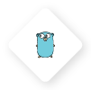

<h1 align="center">We're Platform.sh! </h1>

 

Platform.sh is a unified, secure, enterprise-grade platform for building, running and scaling web applications. We provide a solution that addresses the complexity of application delivery, something that provides both the stability and flexibility you would like to achieve with platform engineering, all with one unified, secure, enterprise-grade platform. 

From our platform, you can standardized your application delivery across any architecture design, framework, or programming language, and easily enforce common compliance standards across them all. It's flexible enough to experiment with new features quickly on true staging environments, and promote them to production with a git merge. 

With a common platform and single API in place for packaging, provisioning, and deploying applications, it's then possible to focus DevOps work on optimizing those apps. Whether that be application performance, or coordinating all of your operations, all for the purpose of minimizing the environmental impact of your organization's work. 

Our key features include:

<h2><strong>The workflow</strong></h2>

<h2><strong>A place to experiment and evolve your apps</strong></h2>

<h2><strong>Managing fleets of applications</strong></h2>

<h2><strong>Stability, security, and governance</strong></h2>

<h2><strong>Performance and optimization</strong></h2>

* **GitOps: Git as the source of truth**

    Every branch becomes a development environment, and nothing can change without a commit.

* **Batteries included: Managed infrastructure**

    [Simple abstraction in YAML](https://docs.platform.sh/configuration/yaml.html) for [committing and configuring infrastructure](https://docs.platform.sh/overview/structure.html), fully managed patch updates, and 24 [runtimes](https://docs.platform.sh/languages.html) & [services](https://docs.platform.sh/configuration/services.html) that can be added with a single line of code.

* **Instant cloning: Branch, merge, repeat**

    [Reusable builds](https://docs.platform.sh/overview/build-deploy.html) and automatically inherited production data provide true staging environments - experiment in isolation, test, then destroy or merge.

* **FleetOps: Fleet management platform**

    Leverage our public API along with custom tools like [Source Operations](https://docs.platform.sh/configuration/app/source-operations.html) and [Activity Scripts](https://docs.platform.sh/integrations/activity.html) to [manage thousands of applications](https://youtu.be/MILHG9OqhmE) - their dependency updates, fresh content, and upstream code.

To find out more, check out the demo below and go to our [website](https://platform.sh/product/).

 

<strong>Contribute, request a feature, or check out our resources</strong>
 
 
&nbsp&nbsp&nbsp&nbsp&nbsp&nbsp
&nbsp&nbsp&nbsp&nbsp&nbsp&nbsp
&nbsp&nbsp&nbsp&nbsp&nbsp&nbsp
&nbsp&nbsp&nbsp&nbsp&nbsp&nbsp
&nbsp&nbsp&nbsp&nbsp&nbsp&nbsp
&nbsp&nbsp&nbsp&nbsp&nbsp&nbsp

  

